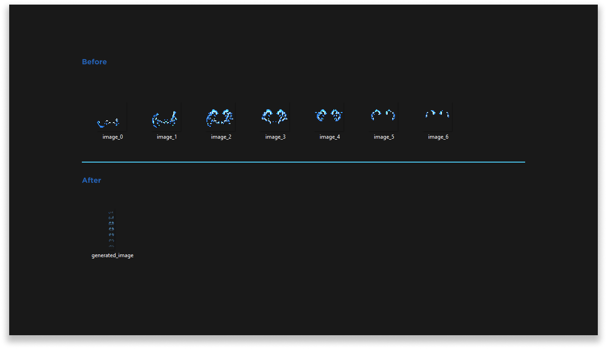

# Particle Sequence Merge - 
Simple program to merge PNG image sequences into a single image for particle creations for Minecraft.

## Merge the files
1. Download the latest version [here](https://github.com/Seface-Blocks/particle-sequence-merge/releases/latest).
2. Execute `SefacesParticleSequenceMerge.exe` file.
3. Place the relative path to a folder with all the images that you want to generate.
   - You can leave the path blank to use the default path `images/`. 
     Have in mind that if the directory doesn't exist, the file will not be generated.
4. Write a cool name for your image.
   - You can leave the image name blank to use the default name `particle.png`.
5. The result will be generated in the same executable directory.

### Contact
Leonardo Luiz Gava - [@llgava](https://twitter.com/llgava "Leonardo Luiz Gava • Twitter") - <me@llgava.net>
